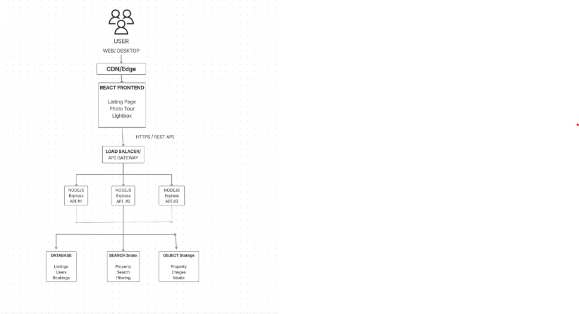
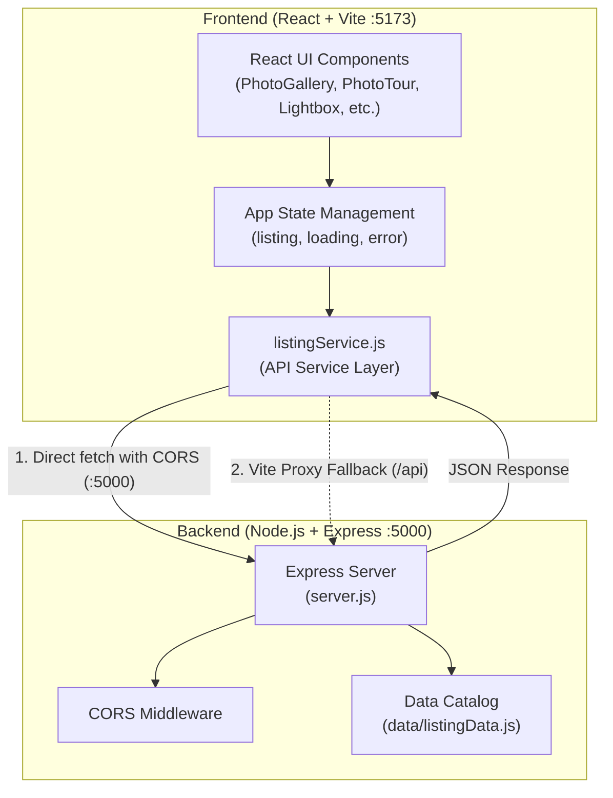

# Airbnb Clone — Property Listing & Photo Tour

A high-fidelity desktop recreation of the Airbnb property listing experience (*"Romantic Jacuzzi 1BHK Candolim | Mirashya UG10"*), built as a full-stack web application featuring an Express backend API and a dynamic React frontend.

---

## Table of Contents

- [Project Overview](#project-overview)
- [Architecture & Data Flow](#architecture--data-flow)
- [Key Features](#key-features)
  - [Main Listing Page](#main-listing-page)
  - [Dedicated Photo Tour](#dedicated-photo-tour)
  - [Full-Screen Lightbox](#full-screen-lightbox)
- [Tech Stack](#tech-stack)
- [Project Structure](#project-structure)
- [Getting Started](#getting-started)
  - [Prerequisites](#prerequisites)
  - [Backend Setup](#backend-setup)
  - [Frontend Setup](#frontend-setup)
- [API Endpoints](#api-endpoints)
- [AI-Assisted Development Workflow](#ai-assisted-development-workflow)

---

## Project Overview

This project faithfully replicates Airbnb's desktop listing interface following reference production designs. The application is completely decoupled: all property details, photo catalogs, room categories, sleeping arrangements, amenities, and reviews are served by an Express REST API on port `5000`, while the React client on port `5173` communicates via a clean service layer with error handling and loading states.

---

## Architecture & Data Flow





---

## Key Features

### Main Listing Page
- **Navigation Header**: Airbnb brand logo mark, search pill (`Anywhere | Anytime | Add guests`), host prompt, language selector, and profile menu.
- **Sticky Sub-Header**: Smoothly animates into view when scrolling past the hero gallery. Features live section tracking (`Photos`, `Amenities`, `Reviews`, `Location`), price per stay, star rating, and a smooth-scrolling "Reserve" action button.
- **Hero Photo Gallery**: Asymmetric 5-photo grid with rounded outer corners (12px), inner hover transitions, and a "Show all photos" button with a 9-dot grid icon.
- **Property Specs & Highlights**: Serviced apartment overview (3 guests · 1 bedroom · 1 bed · 1 bathroom), host avatar with years hosting, key highlights (Outdoor entertainment, Designed for staying cool, Self check-in), auto-translated note, and expandable description text.
- **Guest Favourite Badge**: Dual laurel wreath illustrations with 3D drop-shadows, 4.95 score with 5 filled stars, and 19 reviews count.
- **Where You'll Sleep**: Room preview cards for Bedroom (1 double bed) and Living room (1 sofa) with rounded photo thumbnails.
- **Amenities**: 2-column icon grid with strikethrough for missing alarms, plus a "Show all 50 amenities" button opening a categorized modal.
- **Interactive Calendar**: Dual-month calendar showing the booked stay range (18 Oct 2026 – 23 Oct 2026), "Clear dates" action, and keyboard accessibility.
- **Sticky Reservation Card**: Floating reservation box with 10% promotional discount banner, price calculation, check-in/checkout dates, interactive guest stepper popover, free cancellation notice, and "Reserve" button.
- **Reviews Section**: Large 4.95 score with laurels, 7-column rating breakdown (Overall rating bar chart, Cleanliness, Accuracy, Check-in, Communication, Location, Value), filter tags, and 2-column guest review cards.
- **Location & Host Details**: Map preview with location marker, Candolim/Goa neighbourhood overview, Superhost statistics, and co-hosts roster.
- **Things to Know & Nearby Stays**: 3-column house rules and cancellation policy, followed by a 5-listing carousel of nearby properties.

### Dedicated Photo Tour
- **Full-Screen Dedicated View**: Activated via "Show all photos" or direct URL (`?modal=PHOTO_TOUR_SCROLLABLE`).
- **Fixed Top Header**: Left back arrow, centered "Photo tour" label, and Share/Save actions.
- **Disappearing Thumbnail Strip**: Horizontal category thumbnail buttons (`Living room 1`, `Living room 2`, `Full kitchen`, `Bedroom`, `Full bathroom`, `Gym`, `Exterior`, `Pool`, `Additional photos`) that naturally scroll away with the page.
- **Asymmetrical 2-Column Gallery**: Left column displays room title and specific amenities list; right column displays organized photo compositions (hero-then-pair or paired) with consistent gaps and rounded corners.
- **Smooth Navigation**: Clicking any category thumbnail scrolls smoothly to that room section.

### Full-Screen Lightbox
- **Overlay Viewer**: Clean, white-background viewer opening on photo click.
- **Header Info**: Active room/category title centered at the top, position counter (e.g., `1 of 21`), and close (`✕`) button.
- **Navigation Controls**: Left and right circular chevron buttons to navigate through all 21 catalog photos in sequence.
- **Keyboard Support**: Full support for `ArrowLeft` (previous), `ArrowRight` (next), and `Escape` (dismiss).

---

## Tech Stack

| Layer | Technologies |
| :--- | :--- |
| **Frontend** | React 18, Vite 6, Tailwind CSS, Vanilla CSS, Framer Motion, Lucide React |
| **Backend** | Node.js (ES Modules), Express 4, CORS |
| **Data Format** | Normalized JSON (in-memory mock store) |
| **Testing & QA** | Chrome DevTools Protocol (CDP) automated browser verification |

---

## Project Structure

```text
Airbnb Clone/
├── Backend/
│   ├── data/
│   │   └── listingData.js          # Normalized listing details, photos, and categories
│   ├── package.json               # Backend dependencies (express, cors)
│   └── server.js                  # Express API server (port 5000)
├── Frontend/
│   ├── public/                    # Static assets
│   ├── src/
│   │   ├── assets/                # Laurel wreath graphics
│   │   ├── components/            # React UI components
│   │   │   ├── Amenities.jsx
│   │   │   ├── AmenitiesModal.jsx
│   │   │   ├── CalendarSection.jsx
│   │   │   ├── GuestFavourite.jsx
│   │   │   ├── Header.jsx
│   │   │   ├── HostInfo.jsx
│   │   │   ├── HostProfile.jsx
│   │   │   ├── LocationSection.jsx
│   │   │   ├── NearbyListings.jsx
│   │   │   ├── PhotoGallery.jsx
│   │   │   ├── PhotoLightbox.jsx   # Full-screen photo viewer
│   │   │   ├── PhotoTour.jsx       # Dedicated scrollable photo tour
│   │   │   ├── PropertyDescription.jsx
│   │   │   ├── PropertyHeading.jsx
│   │   │   ├── PropertyHighlights.jsx
│   │   │   ├── PropertyInfo.jsx
│   │   │   ├── RatingSummaryBanner.jsx
│   │   │   ├── ReservationCard.jsx # Sticky booking card with promo banner
│   │   │   ├── ReviewsSection.jsx
│   │   │   ├── SleepingArrangement.jsx
│   │   │   ├── StickySubHeader.jsx  # Floating navigation bar
│   │   │   └── ThingsToKnow.jsx
│   │   ├── services/
│   │   │   └── listingService.js   # API client service layer
│   │   ├── App.jsx                # Main application component & data lifecycle
│   │   ├── App.css                # CSS styling rules
│   │   └── main.jsx               # React DOM entry point
│   ├── package.json               # Frontend dependencies & build scripts
│   └── vite.config.js             # Vite configuration with /api proxy
└── README.md
```

---

## Getting Started

### Prerequisites
- **Node.js** (v18.0.0 or higher)
- **npm** (v9.0.0 or higher)

### Backend Setup
1. Open a terminal and navigate to the `Backend` directory:
   ```bash
   cd Backend
   ```
2. Install dependencies:
   ```bash
   npm install
   ```
3. Start the Express server:
   ```bash
   npm start
   ```
   *The server will start on `http://localhost:5000`.*

### Frontend Setup
1. Open a second terminal and navigate to the `Frontend` directory:
   ```bash
   cd Frontend
   ```
2. Install dependencies:
   ```bash
   npm install
   ```
3. Start the Vite development server:
   ```bash
   npm run dev
   ```
   *The client application will start on `http://localhost:5173`.*

4. Open your browser and navigate to `http://localhost:5173`.

---

## API Endpoints

The backend Express application exposes the following REST endpoints:

| Method | Endpoint | Description |
| :--- | :--- | :--- |
| `GET` | `/api/health` | Health check endpoint returning server status and timestamp |
| `GET` | `/api/listing` | Complete listing payload including title, specs, host, amenities, and reviews |
| `GET` | `/api/listing/photos` | Array of 21 catalog photos with room tags, alt text, and URLs |
| `GET` | `/api/listing/categories` | Array of 9 room categories with layout metadata and amenities |
| `GET` | `/api/listing/sleeping-arrangements` | Room-by-room sleeping arrangements (beds and sofa configurations) |

---

## AI-Assisted Development Workflow

This project was developed with the assistance of **Google DeepMind's Antigravity** AI assistant in an iterative pair-programming workflow:

1. **Visual QA & Reverse Engineering**: Analyzed reference UI screenshots to identify spacing, typography, component hierarchies, and layout rhythms.
2. **Automated Verification**: Used custom headless Chrome scripts via the Chrome DevTools Protocol (CDP) to capture full-page and section screenshots, verifying visual accuracy across states without manual browser testing.
3. **Decoupled Architecture**: Refactored hardcoded UI data into an independent Express backend, configured CORS and Vite proxying, and implemented an API service layer with clean loading and error states.
4. **Interaction Refinement**: Validated smooth vertical transitions in the Photo Tour, URL search synchronization (`?modal=PHOTO_TOUR_SCROLLABLE`), and keyboard accessibility in the Lightbox viewer.
